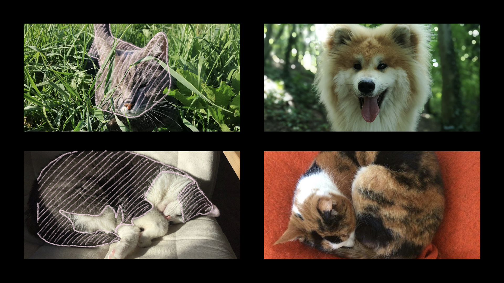

# [fit] Robustness as a Refinement Type

### [fit] *Wen Kokke*, Ekaterina Komendantskaya, Daniel Kienitz, <br /> Robert Atkey, and David Aspinall

#### Lab for AI and Verification, Heriot-Watt University

---

^
So, imagine you’re me, and you’re bored on a Monday night, a couple of days before you have to give a talk… and you decide to try and train a neural network to classify which of your friends have cats, and which have dogs. You ask some friends for pictures of their pets, put together a dataset, and let a neural network have a go…

^
(That cutie on the bottom-right is my cat, by the way. Her name is Zaza.)

^
Anyway, these images are pretty big, like almost half a million pixels. Sure, we can deal with that, but for a neural network, that’s pretty big… so you’re more likely to present them with something like this…


---

^
That’s just over 1000 pixels per image, not too bad… and I bet we could still do an alright job.


---

^
Except for Saucisse in the top-left… Like, that looks like a little french bulldog to me…


---

^
The high-res versions are much more fun to look at…

^
Usually, you’d train a deep convolutional neural network, and hope that it learns some salient features that can be used to tell cats from dogs…

^
We’ve all got quality neural networks, let’s see if we can find some easy features to tell them apart…

^
(Usually, this would be the moment where there’s some crowd interaction… but, well, not all of you can give me direct feedback. Patrick, do you wanna have a go, and give me one difference between cats and dogs that we could use here?)


^
I think I have a simpler one… If there’s anything I know, it’s that dogs LOVE going for walks. So we’re probably more likely to see a dog out and about in nature… and thus… lotsa green!

---

^
And look! Lotsa green around Oki here! That’s good.


---

^
Unfortunately, Saucisse also loves going outside, so lotsa green there as well… But maybe we just need to add a second feature?


---

^
See, if there’s one thing I noticed, it’s that almost all cats have grey fur, but dogs NEVER do.



---

^
So… Based on what we’ve seen, I feel fairly confident in saying that dogs have lotsa green, and very little grey.


[.text: #FFFFFF]

$$
\begin{array}{lrl}
\text{dog}(\bar{x}) & :=    & \text{lots_of_green}(\bar{x}) \\
                    & \land & \text{very_little_grey}(\bar{x})
\end{array}
$$

---

^
Let’s slap some axes on there, and would you look at that! They’re already in the right places!

^
It’s like I planned this.

^
Anyway, on the X-axis, we’ve got inverse greyness.


---

^
Let’s abstract away a little, ’cuz technically those images are just points on this plot, and them being… really big… is gonna be a little confusing. So we’ve got this plot, now we’re gonna look for a function which can successfully tell cats from dogs…


---

^
Let’s put a line… here! Everything to the right of that line is dogs!


---

^
But if we now look at Oki, our dog, we see that if pick a point which is only a *tiny* step away, that’s already a cat. Mind you, we don’t have any images that correspond to this point, and we can’t visualise it, ’cuz we’ve reduced the complexity big a huge degree… All we know is its greenness and its ungreyness… We’re just working under the assumption that we’ve correctly identified the feature space in which cats and dogs are (linearly) seperable, and based on that assumption, if something is really close to a known dog… its probabbly still a dog!


---

^
Okay, so let’s move our line a little…


---

^
Now we’ve got the problem the other way around! Points that are REALLY close to Zaza are classified as dogs! What if we put a tiny green hat on her? Even the smallest bit of green can push the classifier into “dog” now!


---

^
What if I put a tiny green hat on my cat? Does that look like a dog to you? It does to the classifier.


# [fit] - Dog?

---

^
Okay, final move, we’re putting the line smack-dab in the middle… Now, if we take small steps from ANY known cat or dog, the classification remains the same…


---

^
Let’s take stock:
- Base concepts, like “input data”, “features”, and “training”.
- You can extract features manually, like we did, but for deep neural networks, i.e., networks with multiple layers, the hope is that the first few layers learn to isolate the relevant features, and the last few layers perform classification based on those features.
- We’ve seen that neural networks are sneaky bastards. They don’t necessarily use the features you’d expect them to. Usually, this shows up because of flaws in your dataset, and this can have massive consequences.
- We’ve learned about adversarial examples—when I put a tiny green hat on my cat, to trick the network into classifying her as a dog, with minimal changes, and without changing how humans would classify her.
- We’ve seen robustness to adversarial examples—specifically, by measuring distance in the feature space.

# What have we seen so far?

---

^
So we’ve set the scene…

# What’s still to come?

---

^
So the data science that I’ve done in this talk so far was *terrible*, I hope you noticed. There’s a reason for that: We tend to think of verification, more or less, as a replacement for testing. You write down your specification, prove that your program follows it, and done! I don’t normally agree with that mindset, but it’s especially harmful here.

^
Verification is no replacement for good data science practices. It only helps you be sure the function you found follows your specification. (And remember, the quality of your specification is likely dependent on the quality of your data.)

[.column]

## Is our data good?

[.column]

## Did we find the right features?

[.column]

## Are we robust around these features?

---

^
However, for this talk, we’re only going to be talking about this very last issue.

^
Specifically, we’re approaching this problem from PL, and look for lightweight approaches to verifying robustness of neural nets.

[.column]

## **Is our data good?**

[.column]

## **Did we find the right features?**

[.column]

## *Are we robust around these features?*

---

^
We’re phrasing robustness as a refinement type.

^
We’re going to do that by talking about, e.g., the type of “images whose features are within some distance of a known cat.”

^
Recall, features are extracted from the data by neural networks, which are fairly constrained functions… they’re sequences of linear functions, alternated with non-linear activation functions (from a highly limited set).

# [fit] Robustness as a Refinement Type

---

^
What’s a refinement type? It’s a type *refined* with an SMT-checkable predicate.

^
For instance, the type of positive real numbers, such as 4, or the type of lists with a certain length… like the list with 0.5 and 1, which has length 2. Or, indeed, the type of images whose features are within some distance of a known cat.

^
The language you see on this slide is F\*, by the way. F\* has very tight integration with Z3, a powerful SMT solver. All F\* programs can be translated to Z3 programs in some way or another, which means that if we write a framework for neural nets in F\*, it can “run” on Z3… and therefore, Z3 will be able to answer simple questions about the network.

# [fit] What’s a refinement type?

A type *refined* with an SMT-checkable predicate.

```fsharp
let ℝ⁺ = (x:ℝ {0.0R ≤ x}) // positive reals

let _ = 4.0R : ℝ⁺ // 0.0R ≤ 4.0R

let vector a n = (xs:list a {length xs = n}) // lists of length n

let _ = [0.5R; 1.0R] : vector ℝ⁺ 2 // length [0.5R; 1.0R] = 2
```

---

^
Let’s get back to our example, and get ourselves a classifier for our pet problem. The architecture we’re going with is VERY simple. It has two inputs (greenness and ungreyness), computes the linear function on the right-hand side, using weights w and bias b, and feeds the answer into the non-linear activation function f.

$$
\begin{array}{l}
\text{classify} : (x_1 \to \mathbb{R}) \to (x_2 \to \mathbb{R}) \to (y : \mathbb{R})\\
\text{classify} \; x_1 \; x_2 = f \; (w_1 x_1 + w_2 x_2 - b)\\
\end{array}
$$

---

^
Let’s fill in some weights, and an activation function.

^
S is the threshold function, which returns 1 if the input is positive, and 0 otherwise. It’s a real bad function to use in machine learning, ’cuz it’s not differentiable, but it’s intuitive… and we’re not gonna be differentiating things anyway.

^
Let’s check: 0.5 + 0.5 = 1, and 1 - 0.9 is 0.1, which gives us 1. Oki is still a dog. The cats are still cats.

$$
\begin{array}{l}
\text{classify} : (x_1 \to \mathbb{R}) \to (x_2 \to \mathbb{R}) \to (y : \mathbb{R})\\
\text{classify} \; x_1 \; x_2 = S \; (0.5 x_1 + 0.5 x_2 - 0.9)\\
\\
S \; x =
\begin{cases}
1, \; \text{if} \; x \geq 0 \\
0, \; \text{otherwise}
\end{cases}
\end{array}
$$

---

^
We’re using F\*, which has refinement types… So let’s translate this to F\*…

^
We’ve got a network, which is given by a matrix of weights, and a list of biases…

```fsharp
val model : network (*with*) 2 (*inputs*) 1 (*output*) 1 (*layer*)
let model = NLast // makes single-layer network
  { weights    = [[0.5R]; [0.5R]]
  ; biases     = [-0.9R]
  ; activation = Threshold
  }

val classify : (x1 : ℝ) → (x2 : ℝ) → (y : ℝ)
let classify x1 x2 = run model [x1; x2]
```

---

^
Let’s write down our specification.

^
You can apply ‘doggy’ to either a greenness or an ungreyness value, and it will return true if it’s within doggy ranges… just happens to work for both features, since they happen to share the same range…

^
We then write a specification, *refining* the type of the classify function to say that if both the greenness and the ungreyness are doggy, then the output of the network is 1, i.e., “dog”.

```fsharp
let ε = 0.1R // how big are tiny steps?

val doggy : (x : ℝ) → bool
let doggy x = 1.0R - ε ≤ x && x ≤ 1.0R + ε

val _ = (x1 : ℝ{doggy x1})
      → (x2 : ℝ{doggy x2})
      → (y  : ℝ{y = 1.0R})
val _ = classify
```

---

^
F\* then compiles everything it knows about this program down to a Z3 query, which you can see here in an idealised form, and sends it off to Z3… to which Z3 replies “sat”, or “yes, this network is robust around doggy inputs.”

```lisp
(define-fun classify ((x1 Real) (x2 Real)) Real
  (ite (>= (- (+ (* x1 0.5) (* x2 0.5)) 0.9) 0.0) 1.0 0.0))
(define-fun doggy ((x Real)) Bool (and (<= 0.9 x) (<= x 1.1)))
(assert (exists ((x1 Real) (x2 Real))
  (=> (and (doggy x1) (doggy x2)) (not (= (classify x1 x2) 1.0)))))
(check-sat)

> unsat ;; it works! your network is totally robust! gj!
```

---

^
So, great, it works, but does it WORK?

^
Clearly, the example we’ve been working with works! But that’s not incredibly representative of neural networks out there in the real world, is it? It’s only got 2 inputs, one layer, and *nobody* uses the threshold function.

# So it works.

# But does it *WORK*?

---

[.header: text-scale(0.75)]

^
So there’s three main issues when it comes to verifying neural networks with SMT-solvers.

[.column]

^
First, SMT solvers don’t *do* non-linear arithmetic, and recall that neural networks are essentially sequences of linear and non-linear functions. (They support something called non-linear real arithmetic, but that really just means you can use multiplication however you want… nothing about exponentials, logarithms, trigonometric functions, etc…)

# ①

## Solvers don’t do *non-linear arithmetic*

[.column]

^
Secondly, the F\* integration with Z3 introduces a *significant slowdown* when compared to hand-written queries. And I mean, “looks like an exponential factor” levels of significant.

# ②

## Integration with F\* introduces a *significant slowdown*

[.column]

^
Lastly, SMT solvers don’t really scale to realistic network sizes. Like I mentioned at the start, working with even moderate resolution images can results in networks with half a million inputs. That’s SMT queries with half a million variables. Not to mention that the size of the queries also scales rather poorly with each layer, since SMT queries don’t really have the concept of “abstraction”… all definitions are inlined… A node in the first hidden layer depends on all inputs… a node in the second hidden layer depends on all nodes in the first hidden layer… each of which depends on all inputs…

# ③

## Solvers *don’t scale* to realistic sizes

---

^
First off, how do we deal with the fact that solvers don’t really deal with non-linear functions? We just approximate our activation functions with a bunch of lines!

^
There’s actually a lot of precedent for stuff like this. The ReLU activation is piecewise-linear, and it’s quite common to take piecewise-linear approximations of activation functions when implementing neural networks on hardware.

^
You can see the piecewise-linear approximation of the sigmoid function, using 1, 5, and 25 evenly-spaced line segments…

# [fit] ① Solvers don’t do *non-linear arithmetic*

Let’s make our activation functions linear!


---

^
We have more sophisticated algorithms, but our experiments show that these simple approximations actually work very well for n>3.

# [fit] ① Solvers don’t do *non-linear arithmetic*

Train with tanh, run with linear approximation!


---

^
Integration with F\* introduces a *significant slowdown*, and I’m talking “that certainly looks exponential” kinds of slowdown. This graph measures the verification time for our pet classifier, generalised to n features. If you can’t find the curve for Z3, it’s because it never goes over 1.

^
F\* encodes the entire program in Z3… including definitions… which means that in the worst case, Z3 – which does equational reasoning – will be tasked with performing reduction… You may notice the different curves for StarChild, the F\* implementation… and that’s because, with careful use of `assert_norm`, you can force F\* do to normalisation before encoding the program to Z3… but clearly, this doesn’t solve the entire issue…

^
Let’s move away from generic encodings! We can clearly get really good results if we formulate our queries carefully, so let’s make sure that we do!

# [fit] ② Integration with F\* introduces a *significant slowdown*

[.column]


[.column]

Ahh! An *exponential*!

Don’t make Z3 do reduction!

Don’t tell Z3 about data-types.

(Unless you *have to*.)

---

^
Finally, when I say “solvers”, I really mean “Z3 and other SMT solvers”. But don’t let that graph I showed you fool you… Z3 is great for those networks ’cuz they’re extremely *shallow*. They map directly from n inputs to 1 output. Once you start getting any more complexity, Z3 starts scaling very, very poorly.

^
That’s ’cuz Z3 solves a very general problem, much more general than we need, really. And in doing so, it ignores tons of structure! There’s a whole lot of other solvers out there, which fit our domain much better. Honorable mentions go out to MetiTarski, which adds support for *exponential* functions… Unfortunately, the documentation for MetiTarski mentions that past nine variables, there’s no chance of ever getting an answer. The wonderfully named en-en-en-um efficiently verifies ReLU networks… and ReLU happens to be one of the more popular choices of activation function… (although, that’s a bit fraught, since we don’t *really* know why they work so well, and recent work seems to indicate that they’re particularly vulnerable to adversarial examples). Marabou also solves ReLU networks, and more generally solves networks with piecewise-linear functions!

^
Unfortunately, none of these are integrated with F\*… and given the support for real number arithmetic in F\*, I don’t think many people actually use refinement types with real number arithmetic… So we’ll likely have to come up with our own integration… fortunately, though, we were already planning to do that!

# [fit] ③ Solvers *don’t scale* to realistic sizes

Z3 ignores tons of structure!

<br />

MetiTarski solves *exponentials*!

nnenum solves *ReLUs*!

Marabou solves *piecewise-linear functions*!

---

[.text: alignment(left)]

# [fit] Robustness as a Refinement Type

- encode *robustness as a refinement type*
- leverage existing integration with solvers
- *lightweight verification* of robustness

but

- need to *improve integration* with solvers
- need *more flexibility* in choosing solvers
